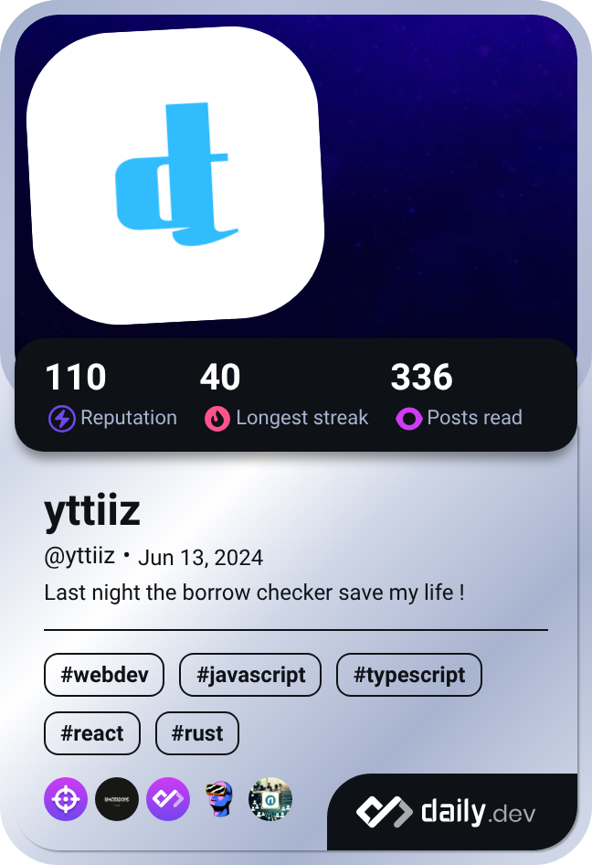

# About me
**Craftsman developer**, I create robust and ergonomic applications. My area of ​​expertise is mainly **web development**. My side hustle revolves around mobile development and desktop software development. 

What I suggest:

- Creation of web applications (with **TypeScript** & **Next.js**)
- Creation of landing page or showcase site (with **HTML**, **CSS** & **Vanilla Javascript**)
- Creation of desktop application (with **Rust** & **Tauri**)
- Creation of mobile applications (with **Kotlin** & **Jetpack Compose**)

# Stack

# Os

